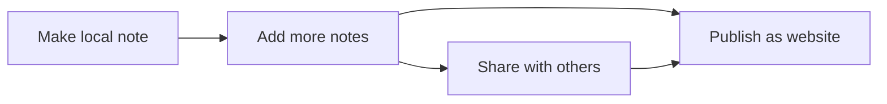

# Design Background for Make it Markdown

## Purpose and principles

Publish great tutorials and howto docs that allow non-technical users to:

- autonomously update and manage markdown-based sites published with Flowershow (e.g. https://lifeitself.org)
- autonomously create and publish catalog content like https://lifeitself.org/ecosystem

Principles

- Publish the tutorials means online at a nice url (not just on github)
- Have a single entry point for users
- Focus on addressing immediate need and make generic as we iterate rather the other way round

## Why (for the world)

TODO

## Background and Motvation: Why we want this guide to building markdown-based sites (for ourselves)

S: We have some instructions and guidelines for using markdown and editing markdown based websites and catalogs in various places (especially editing markdown + git(hub) + flowershow + Obsidian).

C: This duplicates efforts and makes things hard to find. Plus material is not necessarily complete or good enough for non-technical users (e.g. does not cover obsidian). As a result users and especially non-technical users struggle to edit our sites.

Q: What can we do to improve our documentation such that non-technical users can edit existing sites and create new ones - both classic content sites, catalog sites and digital gardens.

A: Identify needs and then consolidate and extend existing material into one site focused on key needs.

## Personas

### Who are we writing for?

We are writing for **non-technical people** i.e. *not* developers. That said, in most tutorials we are assuming ...

- A basic knowledge of markdown
- Already using github

Later we will add support for learning these too.

### If writing for devs we will flag that

If we are writing for a developer/technical editor we will flag that and say e.g. "dev editor" or something like that ...

### Personas List

Our personas and their skill levels. 

| Skill             | Newbie | Markdown-aware | Dev | For Flowershow/PortalJS |
| ----------------- | ------ | -------------- | --- | ----------------------- |
| Markdown          | ❌     | ✅             | ✅  | ✅                      |
| Git               | ❌     | ?              | ✅  | ✅                      |
| Obsidian          | ❌     | ?              | ✅  | ✅                      |
| Hackmd            | ❌     | ❌          | ✅  | ✅                      |
| Backend Knowledge | ❌     | ❌        | ✅  | ✅     ✅               |
| JAMStack          | ❌     | ❌           | ✅  | ✅                      |

- markdown (levels)
  - 0: you don't know what markdown is
  - 1: you know what markdown is and have seen it but aren't familiar
  - 2: ...
  - 3: you are familar with markdown formatting. You could use a markdown editor and know where markdown would be used.
- markdown plus: you know markdown plus the advanced features like footnotes and tables, code blocks etc
- git(hub):
  - 0: you don't know what git or github are
  - 1 You know what it is, the different functionality it can provide and why it is used, and (some of) the associated programs that can be used with it
  - 2 ...
  - 3
- wordpress:  editing previous knowledge related to the backend of programs for visual layout and confidence in navigation i.e. wordpress
- obsidian: none
- hackmd: none?
- any coding/scripting (used in Brevo) (Javascript?): none
- JAMStack: you are familiar with with JAMStack (Javascript + API + Markdown) websites including their construction and deployment. i.e. you are a dev with at least enough knowledge to build and deploy such a site and probably with some javascript knowledge.

## Job Stories

### 4 high level jobs / journeys

- **Website: put content on the web.** Create a markdown-based website, update it, add collaborators and discover markdown superpowers 🚀🦸‍♀
- **Collections: create and publish collections of things**: Create markdown-based "database/catalogs", collaborate on it and publish it ...
- **Data**: **Publish data or data stories**. Create markdown-based data catalog/portal/data-rich content, update it and publish it
- **Garden: make a knowledge garden.** create a markdown-based wiki / knowledge garden with linked notes and more.

And a combo one: (very common actually)

- **Publish a site integrating content, collections, data and a garden** I want to build a site combining some or all of these features!

And a sixth "meta" story:

- Why FOGM? i.e. why use FOGM rather than e.g. wordpress to address these jobs?

### Sharing and Publishing: distinct functionality relevant to each high level job story

For each of the above you have a spectrum of potential sharing that relates to "where" you are doing this:

- Personal: you are just creating for yourself e.g. locally on your machine
- Shared: you want to be able to share the result
- Published: published on the web, for everyone to access

A common user journey goes from personal/local first to sharing to publishing on the web.

### Put text on the web

- I want to put a landing page on the web
  - What is a landing page?
  - Hero
  - Call to action
  - Signup etc
- I want to put up a note / post / article / report
  - Long-form text
  - Author
  - Date
  - ...
- I want to create a blog: essentially article plus one very specific version of "collection of stuff"

### Publish Collections

- I want to publish a collection or catalog of stuff: on its own or embedded elsewhere e.g. a portfolio, a data catalog, my favorite movies, a list of books, a list of people ...
  - List of items
  - A browse/search page
  - NB: these can grow more complex e.g. multiple lists of items which connect e.g. organizations and the topics they work on

### Publish Data

TODO

### Knowledge garden

- I want to create a knowledge garden/wiki: i.e. docs are **interlinked**
